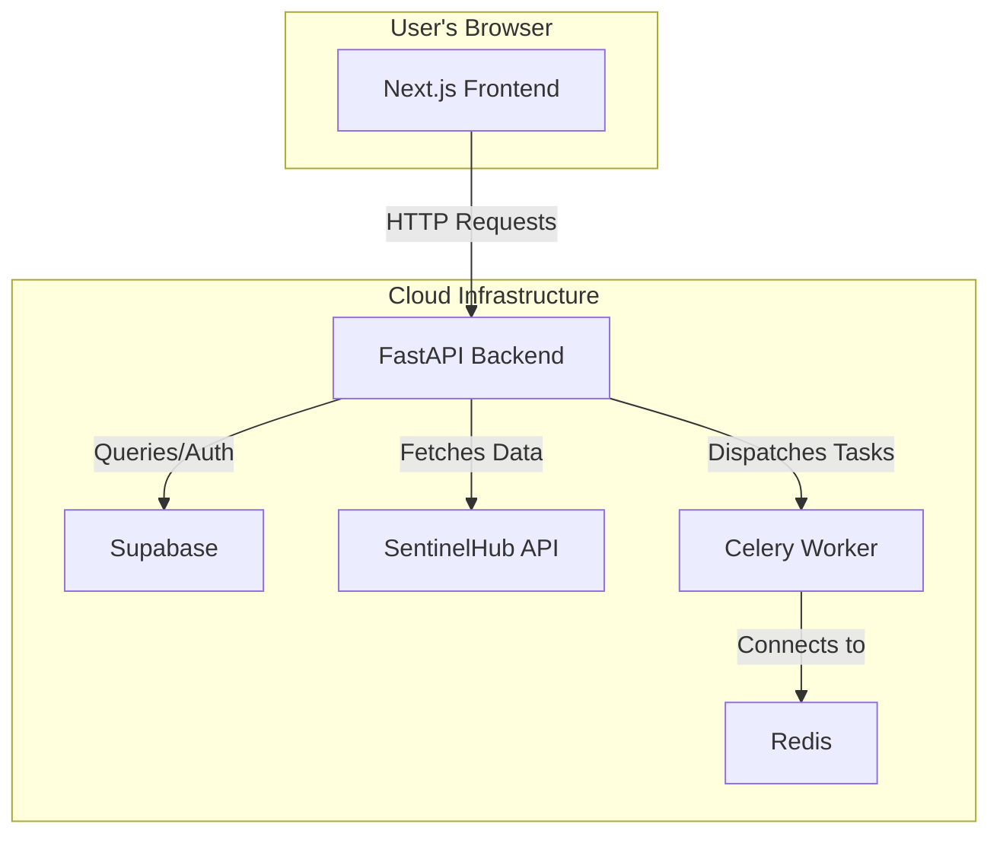
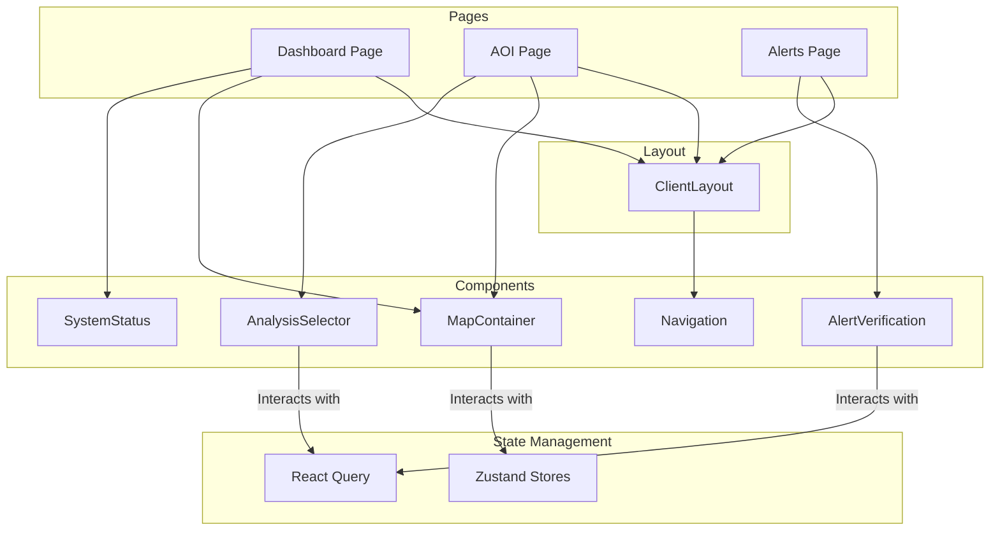
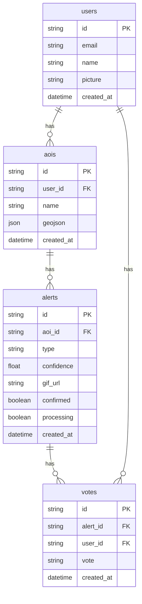
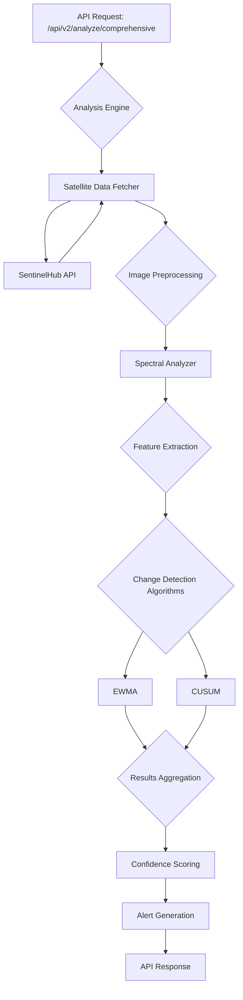

# GeoGuardian Project Documentation

## 1. Project Overview

GeoGuardian is a web-based environmental monitoring platform designed for real-time satellite imagery analysis. It empowers users to monitor environmental changes, such as deforestation, coastal erosion, and water quality variations, by leveraging advanced algorithms and satellite data. This document provides a comprehensive overview of the project's architecture, components, and current status, intended to serve as a reference for further development.

### 1.1. Key Features

*   **Area of Interest (AOI) Management:** Users can define, save, and manage geographical areas they want to monitor.
*   **Real-time Satellite Analysis:** The platform fetches and processes recent satellite imagery (primarily from Sentinel-2) for the defined AOIs.
*   **Change Detection:** It employs a suite of algorithms (EWMA, CUSUM, and spectral analysis) to detect environmental changes between different time points.
*   **Alerting System:** When significant changes are detected, the system generates alerts for the users.
*   **Data Visualization:** The platform provides visualizations of the analysis results, including side-by-side image comparisons and change detection masks.
*   **User Authentication:** Secure user authentication is implemented using Google OAuth and email/password.

### 1.2. Technology Stack

*   **Frontend:**
    *   Next.js (React framework)
    *   TypeScript
    *   Tailwind CSS
    *   Sentinel Satelite Imagery (in place of map)
    *   Zustand (for state management)
    *   React Query (for data fetching)
*   **Backend:**
    *   FastAPI (Python web framework)
    *   Python 3.x
    *   Supabase (for database and authentication)
    *   SentinelHub API (for satellite data)
    *   Celery (for background task processing)
*   **Database:**
    *   PostgreSQL (managed by Supabase)

## 2. System Architecture

The GeoGuardian platform follows a client-server architecture, with a Next.js single-page application (SPA) for the frontend and a FastAPI-based RESTful API for the backend.



### 2.1. Frontend Architecture

The frontend is a modern SPA built with Next.js. It is responsible for all user interactions, including:

*   User authentication (login, registration).
*   Creating and managing AOIs on an interactive map.
*   Displaying analysis results and alerts.
*   Visualizing satellite imagery and change detection data.

#### 2.1.1. Component Architecture

The following diagram illustrates the high-level component architecture of the frontend:



#### 2.1.2. Key Components

*   **`ClientLayout`:** This is the main layout component that wraps all pages. It includes the primary navigation and the notification system.
*   **`Navigation`:** The sidebar navigation component that allows users to move between the main pages of the application.
*   **`MapContainer`:** A central component that renders the Leaflet map. It is responsible for:
    *   Displaying AOIs as polygons on the map.
    *   Handling user interactions, such as drawing new AOIs and selecting existing ones.
    *   Displaying satellite imagery as map layers.
*   **`DashboardPage`:** The main page for authenticated users. It provides a high-level overview of the user's AOIs, recent analyses, and alerts.
*   **`SystemStatus`:** A component that displays the real-time status of the backend system, including the availability of the database, analysis engine, and other services.
*   **`AnalysisSelector`:** A component that allows users to select the type of analysis they want to perform on an AOI.
*   **`AlertVerification`:** A component that allows users to verify the alerts generated by the system by agreeing or disagreeing with the detected change.

### 2.2. Backend Architecture

The backend is a Python-based API built with FastAPI. Its key responsibilities include:

*   **API Endpoints:** Providing RESTful endpoints for the frontend to interact with.
*   **User Authentication:** Handling user registration, login, and session management via Supabase.
*   **Database Interaction:** Managing all database operations through Supabase's Python client.
*   **Satellite Data Acquisition:** Fetching satellite imagery from the SentinelHub API.
*   **Analysis Engine:** Orchestrating the analysis of satellite imagery using various algorithms.
*   **Background Tasks:** Offloading long-running analysis tasks to Celery workers.

## 3. Backend API

The backend exposes a RESTful API with versioned endpoints (`/api/v1` and `/api/v2`).

### 3.1. Authentication (`/api/auth`)

*   `POST /google`: Authenticate a user with a Google OAuth token.
*   `POST /register`: Register a new user with email and password.
*   `POST /login`: Log in a user with email and password.
*   `GET /me`: Get the current user's information.

### 3.2. Areas of Interest (`/api/v1/aoi`, `/api/v2/aoi`)

*   `POST /`: Create a new Area of Interest.
*   `GET /`: Get all AOIs for the current user.
*   `GET /{aoi_id}`: Get a specific AOI by its ID.
*   `DELETE /{aoi_id}`: Delete an AOI.

The `v2` API for AOIs provides enhanced validation, automatic area calculation, and more detailed responses.

### 3.3. Alerts (`/api/v1/alerts`, `/api/v2/alerts`)

*   `GET /aoi/{aoi_id}`: Get the latest alert for a specific AOI.
*   `GET /{alert_id}`: Get a specific alert by its ID.
*   `GET /`: Get all alerts for the current user.
*   `POST /verify`: Submit a verification vote for an alert.

The `v2` API for alerts offers advanced filtering, pagination, and more comprehensive alert data.

### 3.4. Analysis (`/api/v2/analysis`)

*   `POST /analyze/comprehensive`: Perform a comprehensive analysis on an AOI, utilizing advanced algorithms and real-time data processing.
*   `GET /data-availability/preview`: Get a preview of the satellite imagery for a given AOI.
*   `GET /system/status`: Get the real-time status of the backend system and its components.
*   `GET /capabilities`: Get detailed information about the analysis capabilities of the system.

## 4. Frontend Application

The frontend is organized into several key directories:

*   `src/app`: Contains the main application pages and layouts.
*   `src/components`: Reusable React components used throughout the application.
*   `src/lib`: Utility functions and API client configuration.
*   `src/stores`: Zustand stores for managing global application state.
*   `src/types`: TypeScript type definitions for data models.

### 4.1. Key Frontend Components

*   **`MapContainer`:** A central component that renders the Leaflet map and handles all map-related interactions, including drawing and displaying AOIs.
*   **`DashboardPage`:** The main page for authenticated users, providing an overview of their AOIs, recent analyses, and alerts.
*   **`AuthProvider`:** A component that manages the user's authentication state and provides it to the rest of the application.
*   **`SystemStatus`:** A component that displays the real-time status of the backend system.

### 4.2. State Management

The frontend uses a combination of Zustand and React Query for state management:

*   **Zustand:** Used for managing global UI state and the user's authentication status.
*   **React Query:** Used for fetching, caching, and managing server state, such as AOIs, analyses, and alerts.

### 4.2. State Management

The frontend uses a combination of Zustand and React Query for state management:

*   **Zustand:** Used for managing global UI state and the user's authentication status.
*   **React Query:** Used for fetching, caching, and managing server state, such as AOIs, analyses, and alerts.

## 5. Database Schema

The GeoGuardian database is managed by Supabase and uses a PostgreSQL backend. The schema is designed to store user information, areas of interest, analysis alerts, and community verification votes.

### 5.1. ERD Diagram



### 5.2. Table Descriptions

*   **`users`**: Stores information about registered users.
    *   `id`: Unique identifier for the user (provided by Supabase Auth).
    *   `email`: User's email address.
    *   `name`: User's full name.
    *   `picture`: URL to the user's profile picture.
*   **`aois`**: Stores the Areas of Interest defined by users.
    *   `id`: Unique identifier for the AOI.
    *   `user_id`: Foreign key referencing the `users` table.
    *   `name`: A user-defined name for the AOI.
    *   `geojson`: The GeoJSON representation of the AOI's geometry.
*   **`alerts`**: Stores the alerts generated by the analysis engine.
    *   `id`: Unique identifier for the alert.
    *   `aoi_id`: Foreign key referencing the `aois` table.
    *   `type`: The type of change detected (e.g., `vegetation_loss`, `construction`).
    *   `confidence`: The confidence score of the detection.
    *   `gif_url`: A URL to a GIF visualization of the change.
    *   `confirmed`: A boolean flag indicating whether the alert has been confirmed by the community.
    *   `processing`: A boolean flag indicating whether the alert is still being processed.
*   **`votes`**: Stores the community verification votes for each alert.
    *   `id`: Unique identifier for the vote.
    *   `alert_id`: Foreign key referencing the `alerts` table.
    *   `user_id`: Foreign key referencing the `users` table.
    *   `vote`: The user's vote (`agree` or `disagree`).

*   **Functionality:** The core functionality of the platform is in place. Users can register, create AOIs, and trigger analyses. The backend can fetch satellite data and perform change detection.
*   **API:** The backend API is well-developed, with both `v1` and `v2` endpoints. The `v2` endpoints offer more advanced features and are the recommended choice for new development.
*   **Frontend:** The frontend is functional and provides a good user experience. The dashboard effectively displays key information to the user.
*   **Known Issues/Limitations:**
    *   The Celery workers for background tasks are not fully integrated. Some analysis tasks may run synchronously, potentially leading to longer response times.
    *   Error handling on the frontend can be improved to provide more specific feedback to the user.
    *   The documentation for some of the more advanced analysis algorithms is sparse.

## 6. Setup and Deployment

### 6.1. Backend Setup

1.  **Clone the repository:**
    ```bash
    git clone <repository-url>
    cd <repository-name>/backend
    ```

2.  **Create and activate a virtual environment:**
    ```bash
    python -m venv venv
    source venv/bin/activate  # On Windows, use `venv\Scripts\activate`
    ```

3.  **Install dependencies:**
    ```bash
    pip install -r requirements_enhanced.txt
    ```

4.  **Configure environment variables:**
    Create a `.env` file in the `backend` directory by copying the `env.example` file. Then, fill in the required values.

5.  **Run the application:**
    ```bash
    uvicorn app.main:app --reload
    ```

### 6.2. Frontend Setup

1.  **Navigate to the frontend directory:**
    ```bash
    cd ../frontend
    ```

2.  **Install dependencies:**
    ```bash
    npm install
    ```

3.  **Configure environment variables:**
    Create a `.env.local` file in the `frontend` directory. You can use the `UPDATE_ENV_INSTRUCTIONS.md` file as a guide.

4.  **Run the development server:**
    ```bash
    npm run dev
    ```

## 7. Configuration

### 7.1. Backend Environment Variables

*   `ENVIRONMENT`: The application environment (e.g., `development`, `production`).
*   `SUPABASE_URL`: The URL of your Supabase project.
*   `SUPABASE_ANON_KEY`: The anonymous key for your Supabase project.
*   `SUPABASE_SERVICE_ROLE_KEY`: The service role key for your Supabase project.
*   `DATABASE_URL`: The direct PostgreSQL connection string for your Supabase database.
*   `SENTINELHUB_CLIENT_ID`: Your Sentinel Hub client ID.
*   `SENTINELHUB_CLIENT_SECRET`: Your Sentinel Hub client secret.
*   `SENDGRID_API_KEY`: Your SendGrid API key for sending emails.
*   `FROM_EMAIL`: The email address to send emails from.
*   `FRONTEND_URL`: The URL of the frontend application.
*   `JWT_SECRET`: A secret key for signing JWTs.
*   `REDIS_URL`: The URL of your Redis server for Celery.

### 7.2. Frontend Environment Variables

*   `NEXT_PUBLIC_GOOGLE_CLIENT_ID`: The Google client ID for OAuth.
*   `NEXTAUTH_SECRET`: A secret key for NextAuth.js.
*   `NEXTAUTH_URL`: The URL of the NextAuth.js API.
*   `GOOGLE_CLIENT_ID`: The Google client ID for NextAuth.js.
*   `GOOGLE_CLIENT_SECRET`: The Google client secret for NextAuth.js.
*   `NEXT_PUBLIC_SUPABASE_URL`: The URL of your Supabase project.
*   `NEXT_PUBLIC_SUPABASE_ANON_KEY`: The anonymous key for your Supabase project.

This document provides a high-level overview of the GeoGuardian project. For more detailed information, please refer to the source code and the individual documentation files within the project repository.

## 7. Backend Data Processing and Analysis

The GeoGuardian backend is designed to perform sophisticated environmental analysis by orchestrating a series of steps, from data acquisition to the application of advanced change detection algorithms.

### 7.1. Analysis Pipeline

The following diagram illustrates the data processing and analysis pipeline:



### 7.2. Data Acquisition and Preprocessing

1.  **Satellite Data Fetcher:** When an analysis is requested, the `SentinelDataFetcher` is invoked. It is responsible for querying the SentinelHub API to find the most recent and highest-quality satellite imagery for the specified Area of Interest (AOI).

2.  **Image Selection:** The fetcher retrieves a list of available images and selects the best two for change detection: a **recent image** and a **baseline image**. The selection is based on cloud coverage, data quality, and the time separation between the images.

3.  **Band Extraction:** The backend processes the full 13 spectral bands provided by Sentinel-2, which allows for a wide range of spectral analyses.

### 7.3. Feature Extraction

Once the satellite images are acquired, the `SpectralAnalyzer` is used to extract a rich set of features from the raw image data. This includes a variety of spectral indices that are calculated to highlight different environmental characteristics.

#### 7.3.1. Detailed Spectral Index Calculations

The `SpectralAnalyzer` class calculates several key spectral indices. Here are the detailed formulas and purposes for each index:

*   **Normalized Difference Vegetation Index (NDVI):**
    *   **Formula:** `(NIR - Red) / (NIR + Red)`
    *   **Purpose:** NDVI is a primary indicator of vegetation health and density. Higher values indicate healthier and denser vegetation.

*   **Enhanced Vegetation Index (EVI):**
    *   **Formula:** `2.5 * (NIR - Red) / (NIR + 6 * Red - 7.5 * Blue + 1)`
    *   **Purpose:** EVI is an optimized vegetation index that is more sensitive to changes in areas with high biomass and has reduced influence from atmospheric conditions.

*   **Normalized Difference Water Index (NDWI):**
    *   **Formula:** `(Green - NIR) / (Green + NIR)`
    *   **Purpose:** NDWI is used to delineate open water bodies. It is effective at highlighting areas of surface water.

*   **Modified Normalized Difference Water Index (MNDWI):**
    *   **Formula:** `(Green - SWIR1) / (Green + SWIR1)`
    *   **Purpose:** MNDWI enhances the accuracy of water body extraction, especially in areas where vegetation or built-up land is mixed with water.

*   **Bare Soil Index (BSI):**
    *   **Formula:** `((SWIR1 + Red) - (NIR + Blue)) / ((SWIR1 + Red) + (NIR + Blue))`
    *   **Purpose:** BSI is used to identify areas of bare soil, which is a key indicator for detecting new construction, fallow fields, or land degradation.

*   **Algae Index:**
    *   **Formula:** `Red Edge 1 / Red`
    *   **Purpose:** This index is used to detect the presence of algae in water bodies, which is a key indicator of water quality and potential algal blooms.

*   **Turbidity Index:**
    *   **Formula:** `Red / NIR`
    *   **Purpose:** This index is used to assess the turbidity or cloudiness of water, which can be an indicator of pollution or sediment runoff.

### 7.4. Change Detection Algorithms

The core of the analysis engine lies in its ability to apply multiple change detection algorithms to the extracted features. This multi-algorithm approach provides a more robust and reliable assessment of environmental changes.

#### 7.4.1. EWMA (Exponentially Weighted Moving Average)

The EWMA algorithm is a statistical process control method that is particularly effective at detecting **gradual changes** over time. It works by calculating a weighted average of the time series data, where the weights decrease exponentially for older data points.

*   **How it works:** The algorithm maintains an exponentially weighted moving average of a spectral index (e.g., NDVI). When a new observation arrives, the EWMA is updated. If the updated value exceeds a predefined control limit, a change is detected.
*   **Use Cases:** The EWMA detector is primarily used for monitoring vegetation health and water quality, where changes are often gradual.

#### 7.4.2. CUSUM (Cumulative Sum)

The CUSUM algorithm is another statistical process control method, but it is optimized for detecting **abrupt or sudden changes** in a time series.

*   **How it works:** The CUSUM algorithm accumulates the deviations of the observations from a target mean. When this cumulative sum exceeds a certain threshold, it signals a change. The GeoGuardian backend includes specialized CUSUM detectors for:
    *   **Construction Detection:** Optimized to detect abrupt increases in the Bare Soil Index (BSI).
    *   **Deforestation Detection:** Optimized to detect abrupt decreases in NDVI.
*   **Use Cases:** The CUSUM detector is ideal for identifying events like new construction projects, rapid deforestation, or sudden changes in water bodies.

### 7.5. Results Aggregation and Confidence Scoring

After each algorithm has been applied, the analysis engine aggregates the results and calculates an overall confidence score. This is done by:

1.  **Weighting:** The results from each algorithm are weighted based on the type of analysis being performed. For example, in a vegetation analysis, the results from the EWMA vegetation detector will be given a higher weight.
2.  **Confidence Fusion:** The confidence scores from the individual algorithms are fused to produce a single, overall confidence score for the detected change.
3.  **Priority Level:** Based on the type and confidence of the detected change, a priority level (e.g., `low`, `medium`, `high`) is assigned to the alert.

This multi-faceted approach to analysis allows GeoGuardian to provide a more nuanced and reliable assessment of environmental changes, reducing the likelihood of false positives and providing users with actionable insights.

## 9. Testing and Quality Assurance

### 9.1. Backend Testing

The backend has a suite of tests located in the root of the `backend` directory. These tests are designed to be run as standalone scripts and use the `pytest` framework. The testing strategy includes:

*   **API Endpoint Tests (`test_api_endpoints.py`):** This script sends HTTP requests to the running application to verify that the main API endpoints are up and running and that they return the expected status codes.
*   **Real Data Tests (`test_real_satellite_data.py`):** This is an end-to-end test that attempts to fetch real satellite data for a specific location (Umananda Island). It then uses this real data to test the NDVI calculation and the change detection algorithms. This test is crucial for verifying the entire analysis pipeline.

#### 9.1.1. Running the Backend Tests

To run the backend tests, you can execute the test scripts directly from the `backend` directory:

```bash
python test_api_endpoints.py
python test_real_satellite_data.py
```

### 9.2. Frontend Testing

Currently, there is no formal testing framework (such as Jest or Cypress) set up for the frontend. The `package.json` file does not include a `test` script. This is an area that could be improved in the future by adding a suite of unit and integration tests for the React components and the application's business logic.

## 8. Core Backend Modules: A Deep Dive

This section provides a detailed look at the key backend modules that power the GeoGuardian analysis engine.

### 8.1. AdvancedAnalysisEngine (`core/analysis_engine.py`)

*   **Purpose:** This is the main orchestration engine for all environmental analyses. It integrates multiple change detection algorithms and advanced spectral analysis to provide a comprehensive monitoring framework.
*   **Key Methods:**
    *   `analyze_environmental_change`: This is the primary method that orchestrates the entire analysis process. It takes the before and after images, the AOI geometry, and the analysis type as input, and it returns a detailed analysis report.
    *   `_analyze_vegetation_changes`, `_analyze_water_quality`, `_analyze_coastal_changes`, `_detect_construction_activity`, `_detect_deforestation`: These private methods are responsible for invoking the specific change detection algorithms for each analysis type.
    *   `_calculate_overall_confidence`, `_calculate_priority_level`: These methods are used to fuse the results from the different algorithms and calculate a single, overall confidence score and priority level.
*   **Interaction with Other Modules:** The `AdvancedAnalysisEngine` interacts with almost all other core modules. It uses the `SentinelDataFetcher` to get the satellite data, the `SpectralAnalyzer` to extract features, and the various algorithm classes (EWMA, CUSUM, VedgeSat) to perform the change detection.

### 8.2. SentinelDataFetcher (`core/satellite_data.py`)

*   **Purpose:** This module is responsible for all interactions with the SentinelHub API. It provides a high-level interface for fetching, filtering, and preparing Sentinel-2 satellite imagery.
*   **Key Methods:**
    *   `fetch_imagery`: This method fetches the satellite imagery for a given AOI and date range. It handles the creation of the SentinelHub request, the pagination of the results, and the filtering of the images based on cloud coverage.
    *   `get_latest_images_for_change_detection`: This method selects the best two images for change detection: a recent image and a baseline image. The selection is based on data quality and the time separation between the images.
    *   `_create_comprehensive_evalscript`: This private method creates the `evalscript` that is sent to the SentinelHub API. The `evalscript` is a JavaScript code snippet that defines how the satellite data should be processed on the server side.
*   **Data Classes:**
    *   `SatelliteImage`: A data class that holds the satellite image data along with its metadata (timestamp, cloud coverage, etc.).
    *   `FetchConfig`: A data class that holds the configuration for the data fetcher (max cloud coverage, etc.).

### 8.3. SpectralAnalyzer (`core/spectral_analyzer.py`)

*   **Purpose:** This module is responsible for calculating a wide range of spectral indices from the raw satellite imagery. These indices are then used as features for the change detection algorithms.
*   **Key Methods:**
    *   `extract_all_features`: This is the main method of the class. It takes a satellite image as input and returns a dictionary containing the extracted bands and the calculated spectral indices.
    *   `_calculate_all_indices`: This private method contains the implementations of the different spectral index calculations.

### 8.4. AssetManager (`core/asset_manager.py`)

*   **Purpose:** This module is responsible for creating, storing, and managing all visualization assets, such as GIFs and PNG images.
*   **Key Methods:**
    *   `generate_change_detection_gif`: This method generates a GIF that visualizes the change detection results. The GIF includes frames for the before and after images, a change overlay, and a side-by-side comparison.
    *   `generate_static_overlay_image`: This method creates a static PNG image with the change detection results overlaid on the base image.
    *   `generate_statistical_chart`: This method generates a bar chart that shows the confidence scores of the different algorithms.
*   **Storage:** The assets are stored in a local directory (by default, the system's temporary directory). The `storage_path` can be configured when the `AssetManager` is initialized.