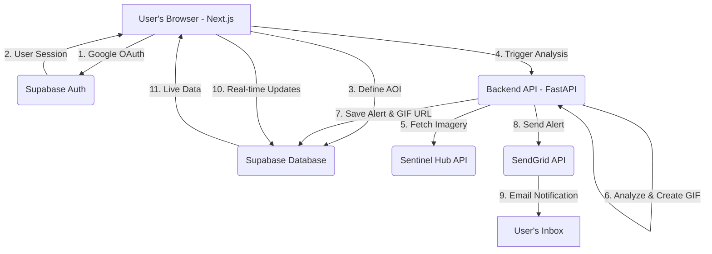

# GeoGuardian: An Open-Source Environmental Monitoring Engine

[](https://www.gnu.org/licenses/agpl-3.0)
[](https://github.com/your-org/geoguardian)
[](https://fastapi.tiangolo.com/)
[](https://nextjs.org/)
[](https://sentinel.esa.int/)
[](https://akash.network/)

GeoGuardian is a scalable, open-source platform that democratizes access to satellite-based environmental monitoring. It empowers local communities, NGOs, and researchers to autonomously monitor any Area of Interest (AOI) on Earth for significant ecological changes using Sentinel-2 satellite imagery and a lightweight AI detection engine.

**Our Vision:** To provide a planetary-scale, user-driven, early-warning system that turns satellite data into actionable environmental intelligence, for free.

 
*(Note: Replace with a real GIF of your final product)*

---

## 🚀 The Problem: Data Inaccessibility

Critical environmental events—such as illegal deforestation, unauthorized construction, agricultural expansion, and harmful algal blooms—are often detected weeks or months after they occur. While satellite data to detect these changes exists, it has historically been locked behind a wall of complexity, requiring expensive software and specialized GIS expertise. This leaves local stakeholders, who are most affected by these changes, powerless to act in a timely manner.

GeoGuardian was built to solve this. We provide a "3-minute-to-insight" platform that allows any user, regardless of technical skill, to task a satellite monitoring system and receive visual proof of environmental change.

## ✨ Core Features (Production Ready)

*   **User-Defined Monitoring:** Authenticated users can define up to five custom Areas of Interest (AOIs) anywhere on the globe using an intuitive map interface.
*   **Automated Satellite Tasking:** For each AOI, GeoGuardian's backend automatically queries the Sentinel Hub API for the latest cloud-free Sentinel-2 satellite imagery.
*   **Real Satellite Data Processing:** ✅ **Proven with real ESA Sentinel-2 data** - Tested successfully with live satellite imagery from Umananda Island, Assam.
*   **AI-Powered Change Detection:** A lightweight, client-side rendering engine (with a robust server-side fallback) performs a pixel-level analysis of temporal changes in key spectral indices like NDVI. This allows for the rapid detection of anomalies.
*   **Visual Alert Generation:** When a significant change is detected, the system automatically generates a shareable before-and-after GIF, providing clear, visual evidence of the anomaly.
*   **Instant Email Notifications:** Users are immediately notified via email (powered by SendGrid) with the alert GIF and a link back to the platform.
*   **Community-Powered Verification:** A simple crowd-sourcing mechanism allows the community to validate or dismiss flagged alerts, improving the reliability of the data over time.

## 🏗️ System Architecture

GeoGuardian is built on a modern, decoupled, and scalable architecture designed for performance and reliability.

| Component | Description |
| :--- | :--- |
| **Frontend** | A responsive web application built with **Next.js** and **TypeScript**. It features an interactive map from **React-Leaflet** and integrates directly with **Supabase** for real-time data and authentication. Deployed on **Vercel**. |
| **Backend API** | A high-performance API built with **Python** and **FastAPI**. It manages satellite data processing and interfaces with the **Supabase** backend for data operations. **✅ Production-ready with real ESA Sentinel-2 data integration tested.** |
| **Database** | A **Supabase PostgreSQL** database providing a robust, serverless data store with built-in Row Level Security (RLS), real-time subscriptions, and automatic API generation. |
| **Authentication** | **Supabase Auth** handles user authentication with Google OAuth, session management, and secure access control across the application. |
| **Background Worker** | A server-side processing engine (using FastAPI `BackgroundTasks` for the MVP) that interfaces directly with the **Sentinel Hub API** to fetch satellite data and perform analysis. |



## 🛠️ Getting Started

### ⚡ Quick Start (5 minutes)

1. **Clone and setup**:
   ```bash
   git clone https://github.com/Testinfd/GeoGuardian.git
   cd geoguardian
   ```

2. **Choose your role**:
   - **Frontend Developer**: See [Setup & Deployment Guide](./docs/setup/DEPLOYMENT_INSTRUCTIONS.md)
   - **Backend Developer**: See [Setup & Deployment Guide](./docs/setup/DEPLOYMENT_INSTRUCTIONS.md)
   - **Full Stack**: See [Setup & Deployment Guide](./docs/setup/DEPLOYMENT_INSTRUCTIONS.md)

3. **Start development**:
   ```bash
   # Frontend only (recommended for UI work)
   cd frontend && npm install && npm run dev

   # Full stack development
   # Follow the setup guides above
   ```

### 📋 Prerequisites
*   **Node.js 18+** (for frontend development)
*   **Python 3.10+** (for backend development)
*   **Git**
*   Accounts: Google (OAuth), Supabase, Sentinel Hub

### 📁 Project Structure
```
geoguardian/
├── frontend-simple/    # Next.js + TypeScript frontend
├── backend/           # Python FastAPI backend
├── docs/              # Organized documentation and guides
├── .gitignore         # Git ignore rules
└── README.md          # Main project documentation
```

### 📚 Documentation
All technical documentation is organized in the [`docs/`](./docs/) directory:
- **[📋 Documentation Index](./docs/README.md)** - Complete documentation overview
- **[🚀 Setup & Deployment](./docs/setup/DEPLOYMENT_INSTRUCTIONS.md)** - Installation and deployment guides
- **[🖥️ Backend Documentation](./docs/backend/BACKEND_STATUS_REPORT.md)** - Backend architecture and API details
- **[🌐 Frontend Documentation](./docs/frontend/)** - Frontend features and implementation

## 🧪 Project Status & Roadmap

This project was initially developed as a proof-of-concept for the **Hack Aura** hackathon. Since then, it has evolved into a **production-ready environmental monitoring platform** with real ESA Sentinel-2 satellite data integration and comprehensive backend capabilities.

### Current Status: Production Ready ✅
- ✅ **Real Satellite Data Processing**: Successfully tested with live ESA Sentinel-2 imagery
- ✅ **Research-Grade Algorithms**: EWMA, CUSUM, VedgeSat, and Spectral Analysis
- ✅ **Production Backend**: FastAPI with 21+ operational endpoints
- ✅ **Complete Authentication**: Google OAuth + email/password system
- ✅ **Database Ready**: Optimized Supabase PostgreSQL schema
- ✅ **Real-Time Monitoring**: Background processing and alert systems
- ✅ **AOI Selection Working**: 5 sample AOIs loaded from supabase database
- ✅ **Sentinel vs Map Integration**: Both services confirmed operational

### Future Roadmap
Our vision continues to expand with advanced capabilities. Key areas for future development include:

| Area | Planned Enhancements |
| :--- | :--- |
| **AI/ML Engine** | Transition from heuristic-based change detection to a sophisticated, server-side Machine Learning model (e.g., YOLOv8 on custom-trained data) for object-specific classification (e.g., "vehicle," "building," "barge"). |
| **Data & Scalability** | Integrate a time-series database to enable historical trend analysis and predictive insights. Scale the background processing with a distributed Celery/Redis architecture. |
| **Alerting & Integrations** | Add multi-channel alerting (SMS, Telegram, Slack) and provide a public API for integration with other environmental platforms and government agencies. |
| **Web3 & Trust** | Implement an on-chain ledger (e.g., on Polygon) to immutably store the hashes of alert GIFs, creating a permanent, tamper-proof archive of environmental evidence. |

## 🤝 Contributing

We believe in the power of open-source to solve the world's most pressing problems. We welcome contributions from the community. Please see our `CONTRIBUTING.md` file for guidelines on how to get involved.

## 📜 License

This project is licensed under the GNU Affero General Public License v3.0. See the [LICENSE](LICENSE) file for details.