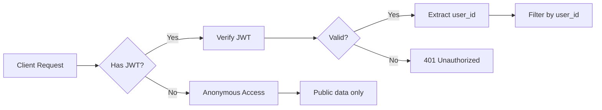

# Authentication & Authorization Guide

## Quick Reference

### Backend Pattern

```python
from ...core.auth import get_current_user_optional
from ...core.database import get_supabase

@router.get("/endpoint")
async def my_endpoint(current_user: User = Depends(get_current_user_optional)):
    supabase = get_supabase()  # Service role client
    
    query = supabase.table("table_name").select("*")
    
    # ALWAYS filter by user_id from JWT
    if current_user:
        query = query.eq("user_id", current_user.id)
    else:
        # Handle unauthenticated access
        query = query.eq("is_public", True)
    
    return query.execute().data
```

### Key Points

1. **JWT Verification**: Always use `get_current_user()` or `get_current_user_optional()`
2. **Manual Filtering**: Filter queries by `current_user.id`
3. **Service Role**: Backend uses service role key (bypasses RLS)
4. **Defense in Depth**: RLS policies are backup protection

## Authentication Flow



## Common Patterns

### Pattern 1: User-Owned Resources

```python
@router.get("/aois")
async def get_aois(current_user: User = Depends(get_current_user)):
    supabase = get_supabase()
    
    # Only return user's own AOIs
    response = supabase.table("aois")\
        .select("*")\
        .eq("user_id", current_user.id)\
        .execute()
    
    return response.data
```

### Pattern 2: Optional Authentication

```python
@router.get("/aois")
async def get_aois(current_user: User = Depends(get_current_user_optional)):
    supabase = get_supabase()
    
    query = supabase.table("aois").select("*")
    
    if current_user:
        # Authenticated: show user's AOIs
        query = query.eq("user_id", current_user.id)
    else:
        # Anonymous: show only public AOIs
        query = query.eq("is_public", True)
    
    return query.execute().data
```

### Pattern 3: Resource with Foreign Key

```python
@router.get("/alerts")
async def get_alerts(current_user: User = Depends(get_current_user)):
    supabase = get_supabase()
    
    # Get user's AOI IDs first
    aois = supabase.table("aois")\
        .select("id")\
        .eq("user_id", current_user.id)\
        .execute()
    
    aoi_ids = [aoi['id'] for aoi in aois.data]
    
    if not aoi_ids:
        return []
    
    # Get alerts for those AOIs
    or_conditions = ",".join([f"aoi_id.eq.{id}" for id in aoi_ids])
    response = supabase.table("alerts")\
        .select("*")\
        .or_(or_conditions)\
        .execute()
    
    return response.data
```

## Security Checklist

### Before Deploying

- [ ] All endpoints use `get_current_user()` or `get_current_user_optional()`
- [ ] All queries filtered by `current_user.id`
- [ ] No hardcoded user IDs
- [ ] Service role key in environment variables only
- [ ] Input validation on all user data
- [ ] Error messages don't leak sensitive info
- [ ] Rate limiting configured
- [ ] CORS properly configured

### Code Review Questions

1. **Does this endpoint verify the JWT?**
   - Look for `Depends(get_current_user)`

2. **Does the query filter by user?**
   - Look for `.eq("user_id", current_user.id)`

3. **Can users access other users' data?**
   - Check for proper authorization logic

4. **Are errors handled safely?**
   - No sensitive data in error messages

## Common Mistakes

### ❌ WRONG: Trusting Client-Provided user_id

```python
@router.get("/aois")
async def get_aois(user_id: str):  # NEVER DO THIS!
    supabase = get_supabase()
    return supabase.table("aois").eq("user_id", user_id).execute().data
```

**Problem:** Client can send any user_id and access other users' data!

### ✅ CORRECT: Using JWT user_id

```python
@router.get("/aois")
async def get_aois(current_user: User = Depends(get_current_user)):
    supabase = get_supabase()
    return supabase.table("aois").eq("user_id", current_user.id).execute().data
```

### ❌ WRONG: No Authorization Check

```python
@router.delete("/aois/{aoi_id}")
async def delete_aoi(aoi_id: str):  # DANGEROUS!
    supabase = get_supabase()
    supabase.table("aois").delete().eq("id", aoi_id).execute()
    return {"status": "deleted"}
```

**Problem:** Anyone can delete any AOI!

### ✅ CORRECT: Verify Ownership

```python
@router.delete("/aois/{aoi_id}")
async def delete_aoi(aoi_id: str, current_user: User = Depends(get_current_user)):
    supabase = get_supabase()
    
    # Verify ownership
    aoi = supabase.table("aois")\
        .select("*")\
        .eq("id", aoi_id)\
        .eq("user_id", current_user.id)\
        .single()\
        .execute()
    
    if not aoi.data:
        raise HTTPException(status_code=404, detail="AOI not found")
    
    supabase.table("aois").delete().eq("id", aoi_id).execute()
    return {"status": "deleted"}
```

## Testing Authentication

### Manual Testing

```bash
# Get JWT token from frontend localStorage
# Then test API:

curl -H "Authorization: Bearer <JWT_TOKEN>" \
     http://localhost:8000/api/v2/aoi

# Should return only user's AOIs
```

### Unit Testing

```python
from fastapi.testclient import TestClient
from app.main import app

client = TestClient(app)

def test_authenticated_access():
    # Create mock JWT
    token = create_test_jwt(user_id="test-user-123")
    
    response = client.get(
        "/api/v2/aoi",
        headers={"Authorization": f"Bearer {token}"}
    )
    
    assert response.status_code == 200
    # Verify only user's data returned
    for aoi in response.json():
        assert aoi["user_id"] == "test-user-123"
```

## Debugging Auth Issues

### Issue: "Unauthorized" errors

**Check:**
1. Is JWT token being sent? (Check browser DevTools → Network)
2. Is token expired? (JWT tokens expire after 1 hour)
3. Is backend verifying correctly? (Check backend logs)

### Issue: User sees 0 resources

**Debug:**
```python
# Add logging
@router.get("/aois")
async def get_aois(current_user: User = Depends(get_current_user_optional)):
    logger.info(f"User ID from JWT: {current_user.id if current_user else 'None'}")
    
    query = supabase.table("aois").select("*")
    if current_user:
        query = query.eq("user_id", current_user.id)
    
    result = query.execute()
    logger.info(f"Found {len(result.data)} AOIs")
    return result.data
```

## Reference Links

- [FastAPI Security Documentation](https://fastapi.tiangolo.com/tutorial/security/)
- [Supabase Auth Guide](https://supabase.com/docs/guides/auth)
- [JWT.io Debugger](https://jwt.io/)

