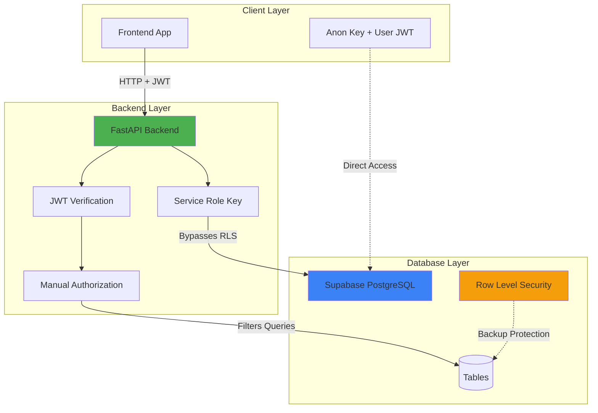
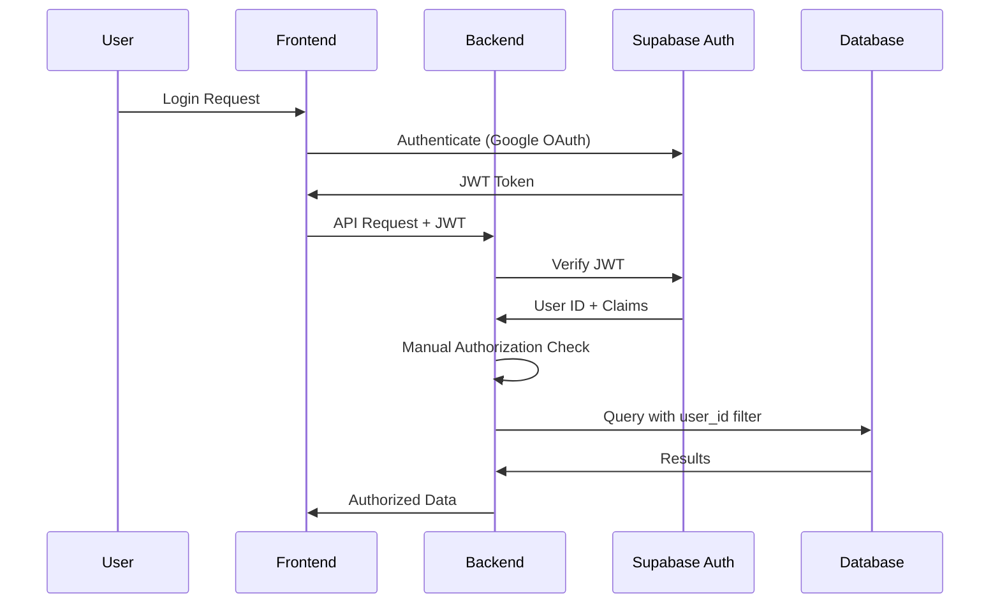
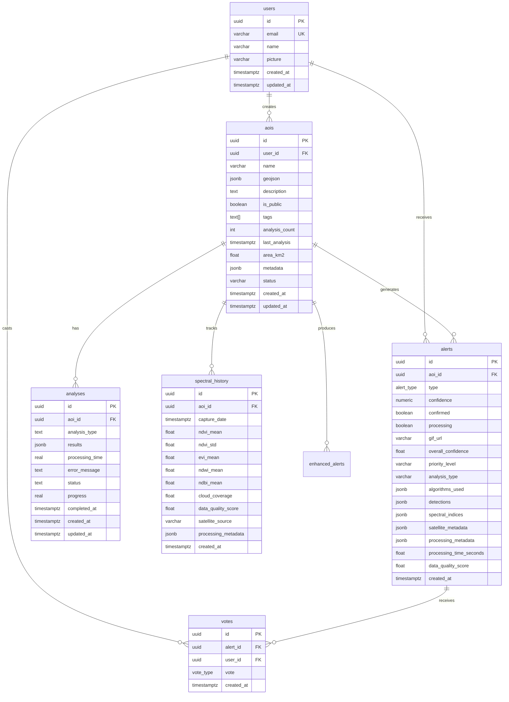
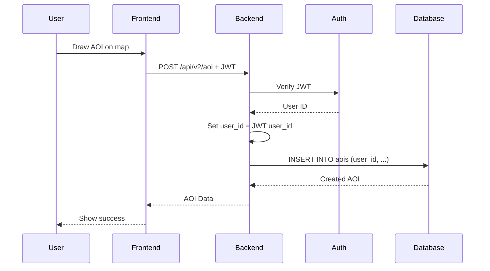
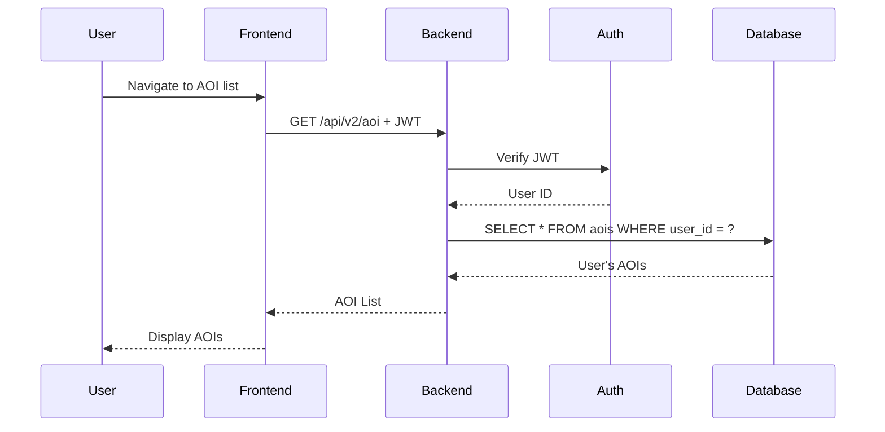

# GeoGuardian Database Architecture

## Overview

GeoGuardian uses **Supabase (PostgreSQL)** as its database with Row Level Security (RLS) for multi-tenant data isolation. The backend uses a hybrid approach: service role key for trusted operations with manual authorization checks.

## Architecture Diagram



## Authentication Flow



## Database Schema

### Core Tables



## Row Level Security (RLS) Policies

### AOIs Table

```sql
-- SELECT: Users can view their own AOIs and public AOIs
CREATE POLICY "aoi_select_policy" ON aois
  FOR SELECT
  USING (
    auth.uid() = user_id  -- Own AOIs
    OR is_public = true    -- Public AOIs
  );

-- INSERT: Users can only create AOIs for themselves
CREATE POLICY "aoi_insert_policy" ON aois
  FOR INSERT
  WITH CHECK (
    auth.uid() = user_id
  );

-- UPDATE: Users can only update their own AOIs
CREATE POLICY "aoi_update_policy" ON aois
  FOR UPDATE
  USING (auth.uid() = user_id)
  WITH CHECK (auth.uid() = user_id);

-- DELETE: Users can only delete their own AOIs
CREATE POLICY "aoi_delete_policy" ON aois
  FOR DELETE
  USING (auth.uid() = user_id);
```

### Alerts Table

```sql
-- SELECT: Users can view alerts for their own AOIs
CREATE POLICY "alerts_select_policy" ON alerts
  FOR SELECT
  USING (
    EXISTS (
      SELECT 1 FROM aois
      WHERE aois.id = alerts.aoi_id
      AND aois.user_id = auth.uid()
    )
  );

-- INSERT: Anyone can create alerts (system-generated)
CREATE POLICY "alerts_insert_policy" ON alerts
  FOR INSERT
  WITH CHECK (true);

-- UPDATE: Users can update alerts for their own AOIs
CREATE POLICY "alerts_update_policy" ON alerts
  FOR UPDATE
  USING (
    EXISTS (
      SELECT 1 FROM aois
      WHERE aois.id = alerts.aoi_id
      AND aois.user_id = auth.uid()
    )
  );
```

## Security Model

### Backend Service Role Pattern

The backend uses **service role key** to bypass RLS, but implements **manual authorization**:

```python
# backend/app/api/v2/aoi.py
async def get_all_aois(current_user: User = Depends(get_current_user_optional)):
    supabase = get_supabase()  # Uses service role key
    
    query = supabase.table("aois").select("*")
    
    if current_user:
        # MANUAL authorization: filter by user_id
        query = query.eq("user_id", current_user.id)
    else:
        # Only show public AOIs
        query = query.is_("user_id", "null")
    
    return query.execute()
```

### Why This Approach?

1. **Backend as Trusted Intermediary**
   - Backend verifies JWT tokens
   - Extracts user identity
   - Enforces business logic
   - Service role allows complex operations

2. **RLS as Defense in Depth**
   - Protects against direct DB access
   - Frontend can use anon key + JWT
   - Multi-layer security

3. **Flexibility**
   - Complex queries without RLS limitations
   - Cross-table operations
   - Admin operations when needed

## Data Flow

### Creating an AOI



### Retrieving AOIs



## Custom Types

### Enums

```sql
-- Alert Types
CREATE TYPE alert_type AS ENUM (
  'trash',
  'algal_bloom',
  'construction',
  'vegetation_loss',
  'vegetation_gain',
  'deforestation',
  'coastal_erosion',
  'coastal_accretion',
  'water_quality_change',
  'urban_expansion',
  'unknown'
);

-- Vote Types
CREATE TYPE vote_type AS ENUM (
  'agree',
  'dismiss'
);
```

## Indexes

### Performance Optimizations

```sql
-- AOIs
CREATE INDEX idx_aois_user_id ON aois(user_id);
CREATE INDEX idx_aois_created_at ON aois(created_at DESC);
CREATE INDEX idx_aois_status ON aois(status);

-- Alerts
CREATE INDEX idx_alerts_aoi_id ON alerts(aoi_id);
CREATE INDEX idx_alerts_created_at ON alerts(created_at DESC);
CREATE INDEX idx_alerts_type ON alerts(type);

-- Spectral History
CREATE INDEX idx_spectral_history_aoi_id ON spectral_history(aoi_id);
CREATE INDEX idx_spectral_history_capture_date ON spectral_history(capture_date DESC);

-- Analyses
CREATE INDEX idx_analyses_aoi_id ON analyses(aoi_id);
CREATE INDEX idx_analyses_status ON analyses(status);
```

## Connection Configuration

### Environment Variables

```bash
# Supabase Configuration
SUPABASE_URL=https://your-project.supabase.co
SUPABASE_ANON_KEY=eyJ...  # For frontend & token verification
SUPABASE_SERVICE_ROLE_KEY=eyJ...  # For backend operations

# Never expose service role key to frontend!
```

### Client Initialization

```python
# backend/app/core/database.py

# Anon client (for auth verification)
supabase_anon = create_client(SUPABASE_URL, SUPABASE_ANON_KEY)

# Service role client (for backend operations)
supabase_service = create_client(SUPABASE_URL, SUPABASE_SERVICE_ROLE_KEY)

def get_supabase() -> Client:
    """Returns service role client for backend operations"""
    return supabase_service

def get_supabase_auth() -> Client:
    """Returns anon client for JWT verification"""
    return supabase_anon
```

## Best Practices

### ✅ DO

1. **Always verify JWT tokens** before database operations
2. **Use service role for backend** with manual authorization
3. **Filter queries by user_id** extracted from JWT
4. **Keep RLS policies simple** - they're backup, not primary security
5. **Log authorization decisions** for auditing
6. **Validate input data** before database writes
7. **Use transactions** for multi-step operations

### ❌ DON'T

1. **Never expose service role key** to frontend
2. **Don't trust client-provided user_id** - always get from JWT
3. **Don't rely solely on RLS** for backend operations
4. **Don't skip JWT verification** - always verify tokens
5. **Don't use SELECT *** without filters** - always filter by user
6. **Don't hardcode credentials** - use environment variables

## Migrations

### Managing Schema Changes

```sql
-- Example migration: Add new column to aois
ALTER TABLE aois 
ADD COLUMN IF NOT EXISTS priority_level VARCHAR(20) DEFAULT 'normal';

-- Update existing rows
UPDATE aois SET priority_level = 'normal' WHERE priority_level IS NULL;

-- Add index
CREATE INDEX IF NOT EXISTS idx_aois_priority ON aois(priority_level);
```

### Applying Migrations

```bash
# Using Supabase CLI
supabase db push

# Or using SQL editor in Supabase dashboard
```

## Monitoring & Maintenance

### Health Checks

```sql
-- Check table sizes
SELECT 
  schemaname,
  tablename,
  pg_size_pretty(pg_total_relation_size(schemaname||'.'||tablename)) AS size
FROM pg_tables
WHERE schemaname = 'public'
ORDER BY pg_total_relation_size(schemaname||'.'||tablename) DESC;

-- Check RLS policies
SELECT tablename, policyname, cmd
FROM pg_policies
WHERE schemaname = 'public';

-- Check active connections
SELECT count(*) FROM pg_stat_activity;
```

### Performance Monitoring

```sql
-- Slow queries
SELECT query, mean_exec_time, calls
FROM pg_stat_statements
ORDER BY mean_exec_time DESC
LIMIT 10;

-- Index usage
SELECT 
  schemaname,
  tablename,
  indexname,
  idx_scan,
  idx_tup_read,
  idx_tup_fetch
FROM pg_stat_user_indexes
ORDER BY idx_scan DESC;
```

## Backup & Recovery

### Automatic Backups

Supabase provides:
- **Daily automatic backups** (retained for 7 days on Free tier)
- **Point-in-time recovery** (Pro tier and above)
- **Manual backup triggers** via dashboard

### Manual Backup

```bash
# Export database schema
pg_dump -h db.your-project.supabase.co \
        -U postgres \
        -d postgres \
        --schema-only \
        > schema_backup.sql

# Export data
pg_dump -h db.your-project.supabase.co \
        -U postgres \
        -d postgres \
        --data-only \
        > data_backup.sql
```

## Troubleshooting

### Common Issues

#### Issue: "0 AOIs" showing despite data in database

**Diagnosis:**
```sql
-- Check if AOIs exist
SELECT id, name, user_id FROM aois;

-- Check if user_id matches JWT
SELECT id, email FROM users WHERE email = 'user@example.com';

-- Verify RLS policies
SELECT * FROM pg_policies WHERE tablename = 'aois';
```

**Solutions:**
1. Clear browser cache and localStorage
2. Verify JWT token is being sent in requests
3. Check backend logs for authorization errors
4. Ensure RLS policies are correct

#### Issue: "Permission denied" errors

**Diagnosis:**
- Backend using anon key instead of service role
- RLS policies too restrictive
- JWT token expired or invalid

**Solution:**
```python
# Ensure backend uses service role
supabase = get_supabase()  # Should return service role client

# Verify JWT before queries
user = await get_current_user(credentials)
# Then filter by user.id
```

## Security Checklist

- [ ] Service role key never exposed to frontend
- [ ] All API endpoints verify JWT tokens
- [ ] Database queries filtered by verified user_id
- [ ] RLS policies enabled on all tables
- [ ] Input validation on all user data
- [ ] SQL injection protection (parameterized queries)
- [ ] Rate limiting on API endpoints
- [ ] Audit logging for sensitive operations
- [ ] Regular security audits
- [ ] Backup strategy in place

## References

- [Supabase Documentation](https://supabase.com/docs)
- [PostgreSQL RLS](https://www.postgresql.org/docs/current/ddl-rowsecurity.html)
- [JWT Best Practices](https://tools.ietf.org/html/rfc8725)
- [FastAPI Security](https://fastapi.tiangolo.com/tutorial/security/)

